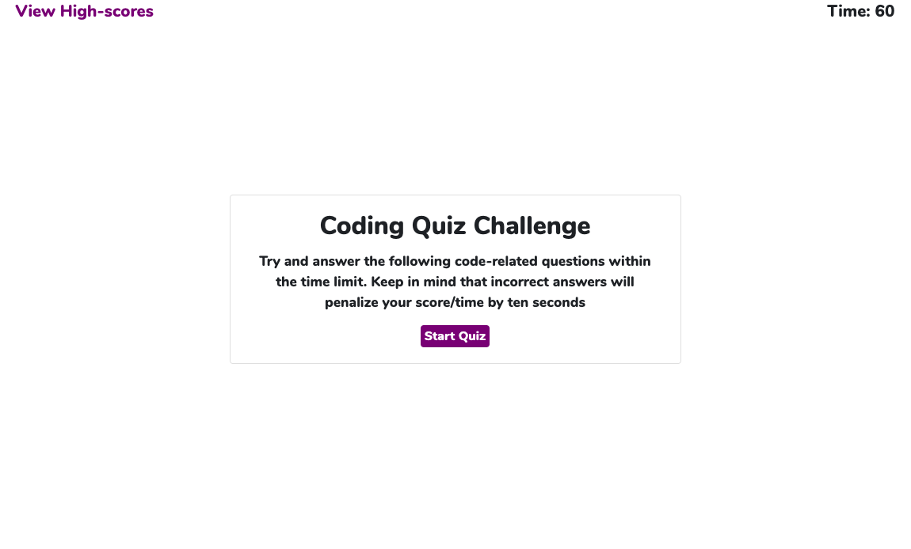
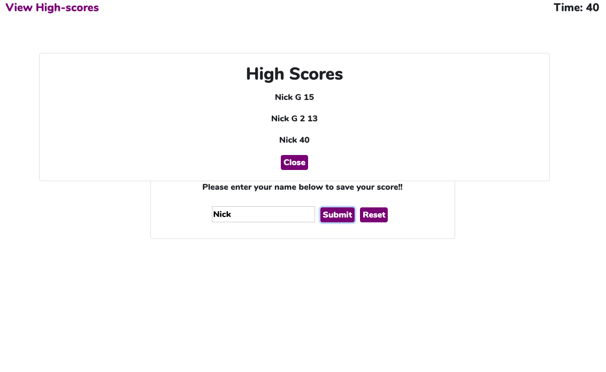

# Coding Quiz

A simple quiz created in Vanilla JavaScript to track your knowledge and retention of information that we've learned in the first four weeks of our Coding Boot Camp.

To take the quiz, please click here: https://ngoudeau2012.github.io/coding_quiz/

## Application Description:
Using JavaScript I had to:
1. Create a timer that started counting down from 60 when the user started the quiz.
2. Generate new new questions every time the user selected an answer.
3. Check weather or not the users answer to the question was correct.
4. If incorrect, subtract 10 seconds from the users remaining time.
5. Stop the timer if the user ran out of time or completed all the questions on the quiz.
6. Record the users score (the amount of time the user had left on the timer) and user name to save to the local storage
7. Add click handlers to all buttons and the "high score" text at the top of the screen.
8. Present the user with a high score modal when the user clicked high score.
9. Display all saved scores in the high score modal.

## Screenshot of Application:

